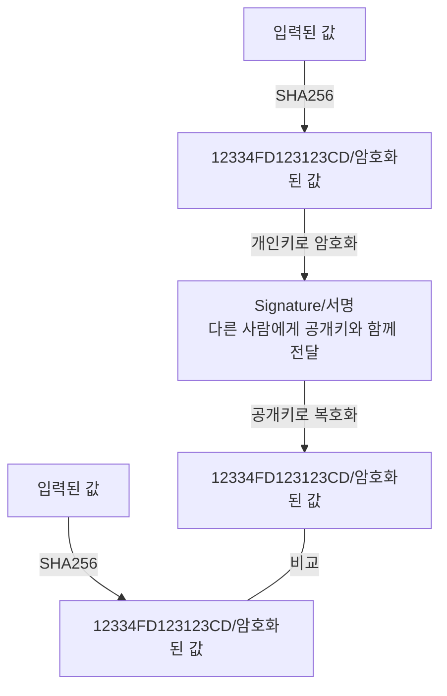

# 암호화

- 블록체인에서 누가 했는지, 즉 신원을 확인하기 위해서 양방향 암호화를 사용한다.
- 지금까지 다뤄왔던 Hash(SHA256)는 단방향 암호화로 복호화가 불가능하다.
- 양방향 암호화는 암호화, 복호화 모두 가능하다.

## 비대칭 암호화

- 블록체인에서 사용하는 양방향 암호화는 개인키와 공개키로 이루어진 비대칭 암호화이다.
- 대칭 vs 비대칭
  - 대칭 암호화
  ```mermaid
  flowchart LR
  A[입력된 값]
  B[12334FD123123CD/암호화된 값]
  C[입력된 값]
  A -->|암호화키\n암호화|B-->|암호화키\n복호화|C
  ```
        - 암호화할때와 복호화할때 같은 암호화키를 사용한다.
  - 비대칭 암호화
  ```mermaid
  flowchart LR
  A[입력된 값]
  B[12334FD123123CD/암호화된 값]
  C[입력된 값]
  A -->|개인키\n암호화|B-->|공개키\n복호화|C
  ```
        - 개인키는 안전하게 보관할 수 있으며 암호문과 공개키를 상대에게 공유함으로써 데이터를 확인할 수 있다.(암호화 할 경우 / 개인키)
        - 공개키로 복호화할 수 있는 암호문은 연결된 개인키로 생성한 암호문 뿐이어야 한다.(어떤 데이터를 암호화할 경우 보는 것 / 공개키)
- 블록체인에서 어떻게 사용하는가?



# 타원곡선

- 암호화 알고리즘 중 하나(ECC, Elliptic Curve Cryptography)
- SHA256은 해시를 만들기 위함이고, 개인키와 공개키를 만들기 위해서 사용한다.(비대칭 암호화 중 하나)
- RSA를 사용하지 않고 ECC를 사용하는 이유

  - 동일한 안정성을 가지면서도 RSA보다 짧은 키를 사용한다.
  - 휴대폰 등 계산을 많이 할 수 없는(성능이 떨어지는) 환경에서 사용된다.
  - 속도가 느리고, 키의 길이가 길다.

- 타원곡선에서 사용하는 함수

  - y^2 = x^3 + ax + b
  - 비트코인과 이더리움에서 사용하는 함수는 y^2 = x^3 + 7 이다.

- 타원곡선에서의 덧셈 규칙

  - P + Q + R = 0 => -R = P + Q
    (암호화된 개인 키(64자리 숫자)는 16진수로 이루어져 있고, 이는 횟수로 표현이 된다. 이는 최대 이동 횟수:16의 64승 이라는 것이다. / 개인키만큼 돌릴 수 있다는 의미 / 공개키의 개수만큼 이동하는 것)

- 개인키(k)

  - 임의의 점 P를 더하여 새로운 점을 찾은 횟수

- 공개키(kP)

  - P를 k번 더해서 찾은 점 (최종 도착한 점)

- 기준점(G) => 서명 뽑아낸 것 (개인키로 암호화 하는 것 === 서명)
  - 이더리움과 비트코인에서 공개키를 구하기 위해 사용하는 점
  - 02 79BE667E F9DCBBAC 55A06295 CE870B07 029BFCDB 2DCE28D9 59F2815B 16F81798 << 실재 사용하고 있는 이더리움 기준점
  - 개인키(k)가 너무 크기 때문에 계산에 있어서 알고리즘을 사용한다.
    - Double-and-Add 알고리즘을 사용한다.
    - 횟수를 2진수로 표기 후 0 또는 1을 더하도록 처리한다.
    - 35 횟수를 예시로 아래의 순서를 진행하겠다.
      - 35 = 2진수로 100011
      - 왼쪽의 첫 자리의 1부터 시작하여 G를 더한다. => 0 \* 2 + G = G
      - 두번째 자리는 0이기 때문에 G \* 2 = 2G
      - 세번째 자리는 0이기 때문에 2G \* 2 = 4G
      - 네번째 자리는 0이기 때문에 4G \* 2 = 8G
      - 다섯번째 자리는 1이기 때문에 8G \* 2 + G = 17G
      - 여섯번째 자리는 1이기 때문에 17G \* 2 + G = 35G
    - 공식으로 보자면, "이전값 \* 2 + 2진수(0, 1) \* G"
    - 개인키가 16진수로 된 64자리의 수 => 16^64 => 이만한 횟수가 256번으로 끝난다. 32 bytes => 256 bits(10100100111010100... << 256 갯수)

# 지갑

- 지갑에서 계정을 생성할 경우 개인키와 공개키를 생성한다.
- 공개키를 사용해서 지갑 주소를 만든다.
  - 비트코인
    - 암호화를 여러번 거친 후에 사용한다.
  - 이더리움
    - 뒤에서부터 40자만 사용한다.
