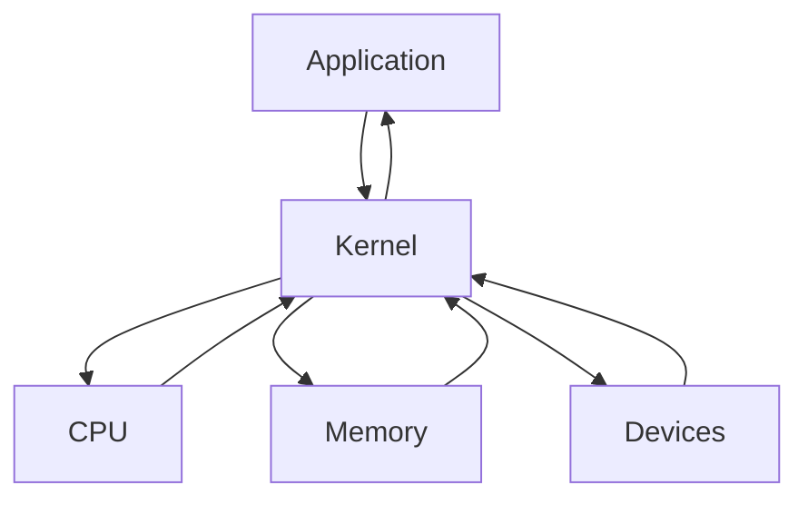

# VM(윈도우에서 ubuntu를 사용하기 위한 내용)

- Virtual Machine의 약자
- OS 내에서 다른 OS를 설치, 실행하는 프로그램
- LPPlayer 등을 포함하는 안드로이드 플레이어, Java에서 사용하는 JVM, Ethereum에서 사용하는 EVM, Windows/Linux/Android 등 거의 모든 OS를 설치할 수 있는 VMWare 등이 있다.
- 단점으로는 물리적인 컴퓨터, 즉 하드웨어의 성능을 본래의 OS와 나누게 된다. => 성능 저하를 일으킨다.

# Kernel

- 커널이란, 하드웨어와 프로그램을 연결해주는 프로그램이다.
- 운영체제(OS)에 포함되어 있다.



# WSL

- Windows SubSystem for Linux
- 윈도우에서 Linux OS를 사용하게 해주는 서비스
- Linux OS에는 Ubuntu, cent OS, Redhat 등이 있다.
  - Linux는 Unix 기반의 OS이다.
  - Mac OS도 Unix 기반의 OS이다.
- WSL은 VM과 조금은 다르다. => VM이 OS 상에서 다른 OS를 설치, 사용하는 것. => VM은 하드웨어 성능을 나눠서 사용하지만 WSL은 Linux의 기반을 설치하지 않고 Windows의 기반을 사용하여 Linux를 실행한다.
  - Linux의 커널을 사용하지 않는다.
  - 성능 저하가 그렇게 크지 않다.
  - 예전에는 OS 충돌이 있었으나 많은 패치로 요즘은 상당히 적어진 상태
- window mac 차이점
- window -> dir 로 경로 확인
- mac -> ls 로 경로 확인 (Linux 기반 명령어)

# 설치

- 기초 확인 사항

1. 윈도우 버전이 20H1 이상일 때 사용 가능
2. 제어판 -> 프로그램 제거 -> 왼쪽 Windows 기능 켜기/끄기 -> Linux용 Windows 하위 시스템 체크
3. Microsoft Store -> Windows Terminal 설치 (cmd보단 powershell과 같은 것으로 나온다.)
   - PowerShell과 같은 것으로 나온다.
   - WSL 사용에 있어서 terminal을 권장한다.
4. terminal에서 아래의 명령어를 입력 (관리자 권한으로 실행)
   ```sh
   - dism.exe /online /enable-feature /featurename:Microsoft-Windows-Subsystem-Linux /all /norestart
     - 배포 이미지 관리
   ```
   ```sh
   - dism.exe /online /enable-feature / featurename:VirtualMachinePlatform /all /norestart
     - 가상 머신 활성화
   ```
5. 아래의 명령어로 설치 가능한 Linux OS를 확인할 수 있다.

```sh
wsl --list --online
```

6. Ubuntu 설치

```sh
wsl --install -d Ubuntu
```

7. Enter new Unix username

- 사용자 이름 입력
- 비밀번호 입력

8. WSL2를 사용하기 위해 아래 프로그램 설치

- Linux 커널 업데이트 패키지 다운로드
  x64 머신용 최신 WSL2 Linux 커널 업데이트 패키지

9. WSL의 버전을 확인하기 위해 아래의 명령어 사용

```sh
wsl -l -v

VERSION 1이어야 한다.
-l : list
-v : version
```

10. WSL 2 버전 사용하기

```sh
wsl --set-version Ubuntu 2
```

11. 터미널에서 Ubuntu 열기

```sh
wsl
나갈 때는 exit
```

-> 터미널에서 ubuntu 기본 경로로 ubuntu 실행
-> ubuntu에서는 홈 경로(숨겨진 파일로 인식)로 실행

12. WSL에서 삭제하고 싶을 때

```sh
wsl -unregister Ubuntu
```

# 기본적인 명령어들

- cd
  - 폴더 이동
  - / : Root 경로 (최상위 경로)
  - ~ : Home 경로 (/home/사용자 이름)
- pwd
  - 현재 경로 출력
- ls
  - 현재 폴더의 내용을 출력
  - 옵션으로 대표적으로 a와 l을 사용
  - ls -al : 권한 용량 등 모든 파일/폴더를 출력(숨긴 파일 포함)
- mkdir
  - 폴더 생성
- clear
  - 화면 초기화
- curl
  - 인터넷 접근(요청)

# Node.js

- 설치

```sh
sudo apt-get update
sudo apt-get upgrade
sudo apt-get install nodejs
node -v 버전 확인
npm -v 버전 확인
```

- Ubuntu에서 Node.js는 최신 버전으로 설치되지 않는다.
  - 해결은 nvm을 사용한다.
  - nvm : Node Version Manager
    - Node.js의 버전을 관리한다.
    - 설치 : curl -o- https://raw.githubusercontent.com/nvm-sh/nvm/v0.39.3/install.sh | bash -> 설치 후 ubuntu 재시작
  - nvm의 명령어들 - nvm ls-remote : 설치 가능한 nodejs의 모든 버전을 보여준다. - nvm ls : 현재 설치된 Node.js 버전을 보여준다. => 여러 버전을 설치 후에 선택하여 사용할 수 있다. - nvm install 18.12.1 (vscode와 맞는 버전)
  - Ubuntu에서 Node.js 버전 선택 nvm use vscode상에서의 node.js 버전
  ```sh
  nvm use 16.18.0
  => 16.18.0 버전을 사용한다.
  ```

# Mac OS에서 프로그램 설치

- homebrew를 사용한다
- apt/apt-get 대신에 사용한다.
- brew install 이름
